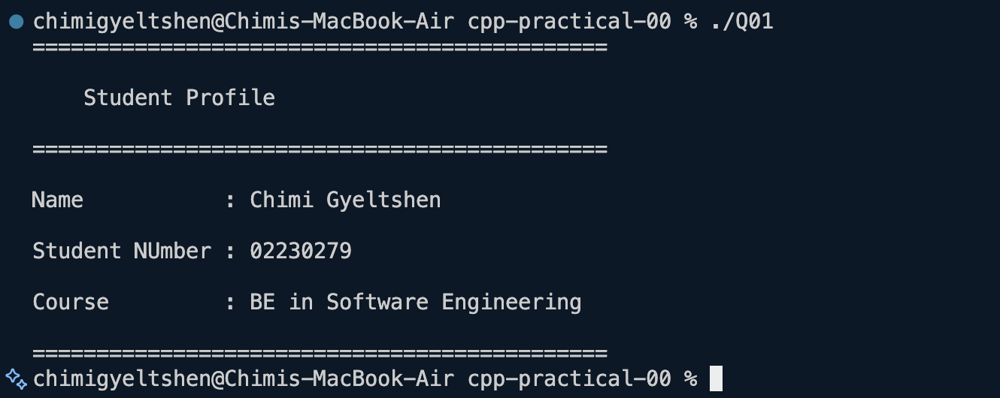
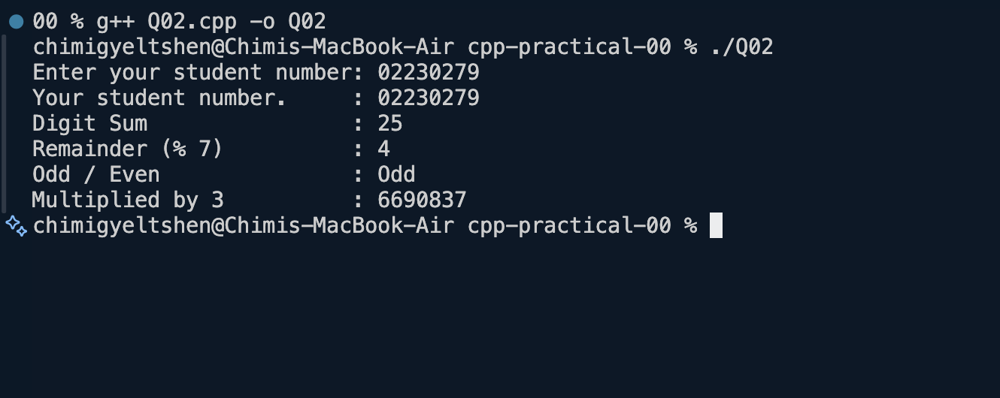
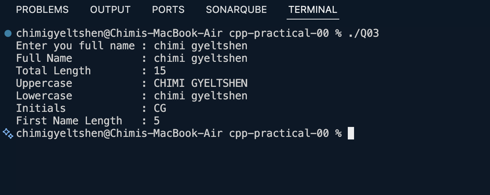
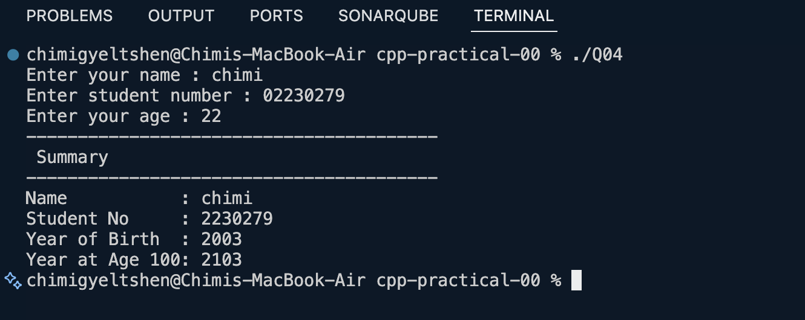
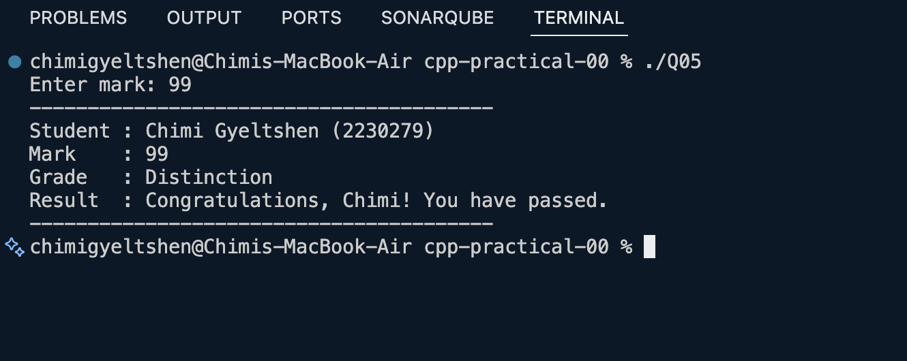
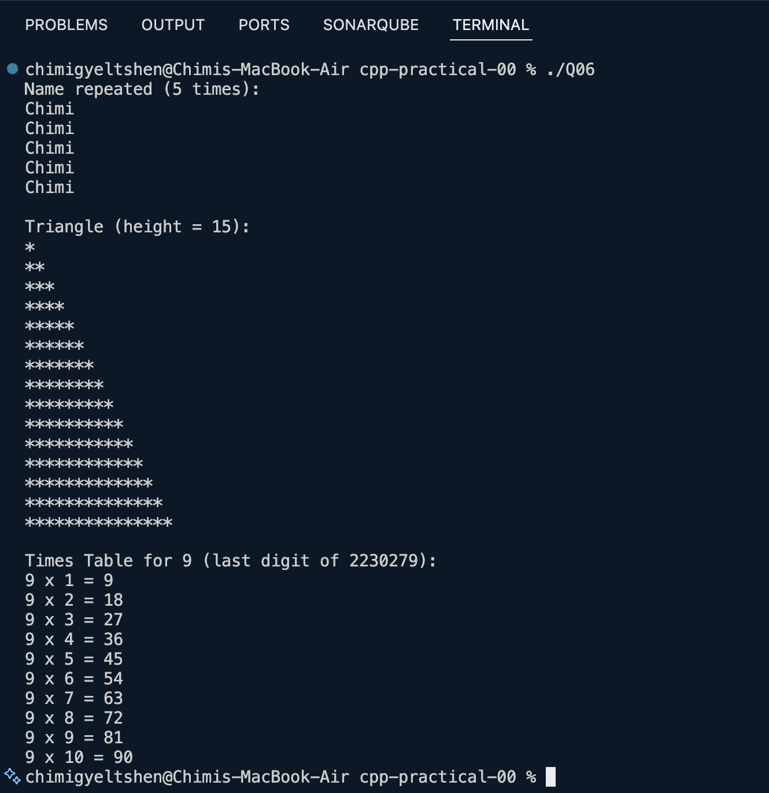
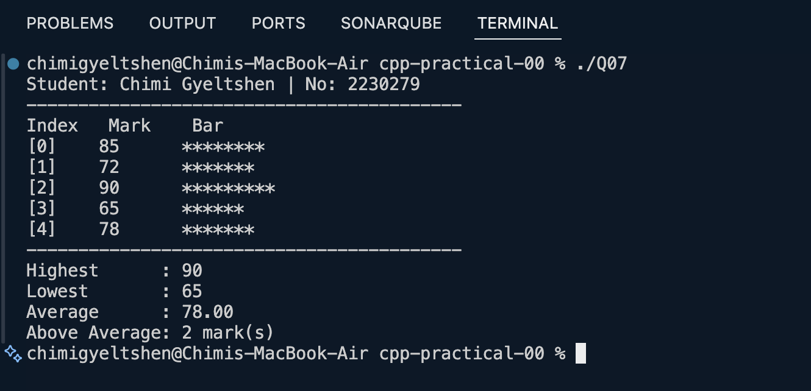
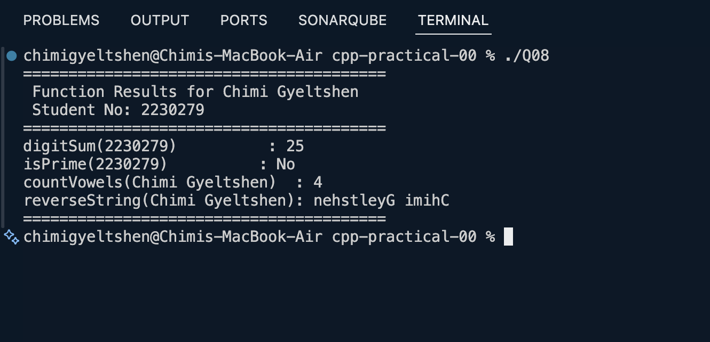
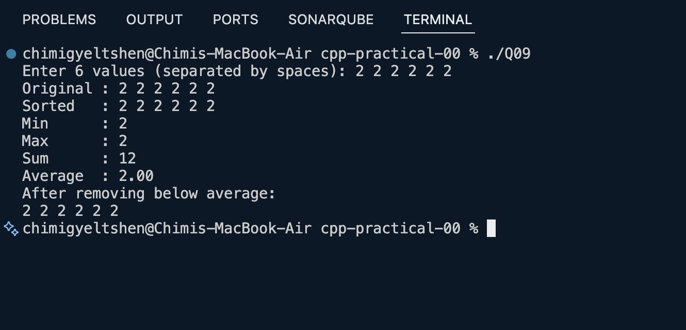
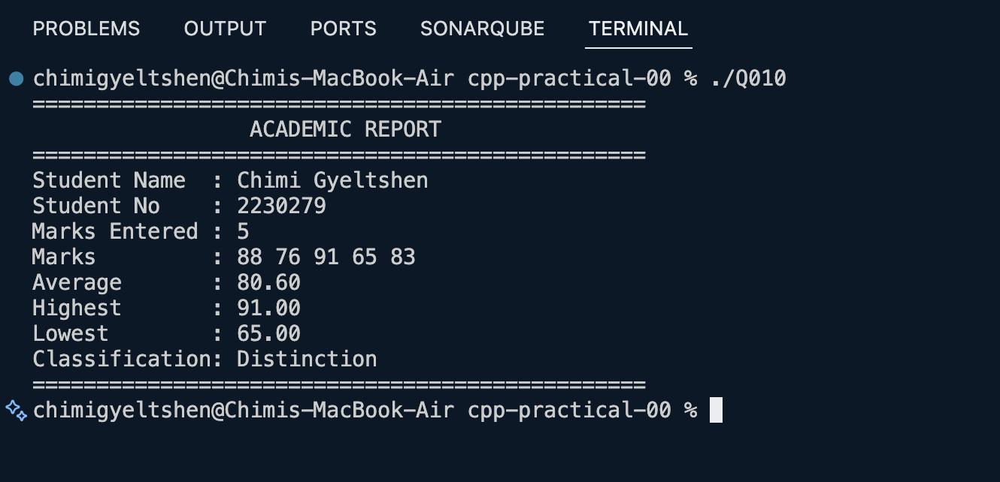

# CSF303 C++ Practical

## Q01 - Personal Introduction
Define your name and student number as variables.
Use cout to print your personal introduction card with labels like name, student no, and course.
Everything is hardcoded and doesn’t require user input.

## Q02 - Arithmetic with Student Number
Define your student number as a variable.
Use cout to print the sum of its digits, whether it is odd or even, its remainder when divided by 7, and the product of your student number and 3.

## Q03 - String Manipulation & Analysis
Define your name as a variable.
Use cout to print the total length of your name, your name in uppercase and lowercase, your name’s initials, and the length of your first name.
Everything is achieved using built-in string functions like length(), toupper(), and tolower().

## Q04 - User Input & Type Conversion
Ask the user to enter their name, student number, and age.
Use the user’s age to determine what year they were born and what year they will turn 100.
Use cout to print everything in a neat summary.

## Q05 — Conditional Grade Classification
Ask the user to enter a grade between 0 and 100.
Use if-else statements to determine whether it is a Distinction, Merit, Pass, or Fail grade.
If it is outside the range of 0-100, an error message will be displayed.

## Q06 — Loop-Based Pattern Generation
Use a loop to print your first name repeatedly (one time for each letter in your name).
Use a nested loop to draw a triangle using asterisks.
Use another loop to print the times table for the last digit of your student ID.

## Q07 — Array Operations & Statistics
Store your 5 test marks in an array.
Determine the highest, lowest, and average marks.
Determine how many of your marks are above average.
Draw a simple bar using asterisks for each of your marks.

## Q08 — Function Design & Modular Programming
Write four different functions:
- `digitSum`: Add up all the digits of a number.
- `isPrime`: Check whether a number is prime or not.
- `countVowels`: Count the vowels in a word.
- `reverseString`: Reverse a word.

Call each of these functions and display the results.

## Q09 — Vector & Dynamic Collections
Ask the user to enter 6 numbers and store them in a vector.
Sort the vector, then find the min, max, sum, and average.
Remove all numbers that are below the average and display what is left.

## Q10 — Classes & Object-Oriented Design
Create a `Student` class that stores a name, student number, and a list of marks.
All data is private – it can only be accessed through methods.
Add marks using `addMark()`, then `printReport()` to display the whole academic report.

